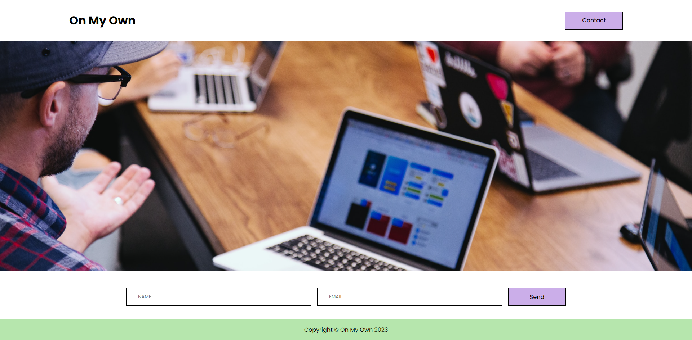

# :full_moon: About The Project

**On My Own** is a mini-project landing page with certain acceptance criteria that was requested as part of a live activity at the **edX Front-End Web Development Bootcamp**.

# :waxing_gibbous_moon: Features

- Semantic HTML elements.
- At least three colors in the design.
- Single font-family for all text.
- Header is fixed to the top of the page on scroll.
- Contact form includes `input` elements for name and email.
- Contact form includes a Send button.
- Image includes a descriptive `alt` attribute.

# :first_quarter_moon: Screenshot

# :waxing_crescent_moon: Technologies

- HTML
- CSS

# :new_moon: Credits

N/A

# :earth_americas: Website

- [On My Own](https://whybruno.github.io/on-my-own)

# :globe_with_meridians: License

MIT License